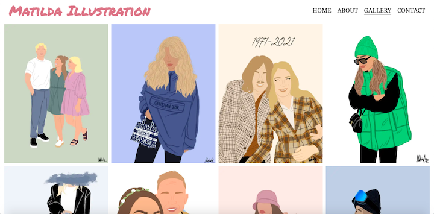

# Matilda illustration

For the first Portfolio Project with Code Institute, I have created a portfolio website for my friend Matilda who makes illustrations and paints acrylics.

For the live site please click [here](https://ajn0r.github.io/matilda-illustration/)

## Who is the website for?

It’s a website for the art interested person, where the user can get to know Matilda and what she does, get inspired and view her work. It is also a good way for the user to be able to get in touch with the artist. 
The website is also for the artist, it's her portfolio website.
The artist is based in Sweden but can send illustrations electronicallyß if the user would like to purchase one.

## The owner

The owner of the page is Matilda Andersson – The artist.
The goal of the owner is to showcase her work, inspire visitors, get more followers on her social media and to receive orders for custom paintings.

## What does it do?

The website serves as a portfolio for the artist, it serves people searching for inspiration and also people looking to order a custom painting with information of what they can expect. It is also an easy way to get in contact with Matilda for questions, orders or anything else the user would like to get in contact for.

## User Experience

### User Goals

- The website must be responsive, so that it can be viewed on a range of screen sizes, from mobile to extra-large screens.
- It must be easy to find information about the artist, her work and how to get in touch.
- The home page should be clear and making the user confident in how to navigate further.
- The website should be easily navigated, making the user want to continue browsing the website.

### User stories

#### From a first time visitors perspective

- As a user I want to easily find information about the artist
- As a user I want to be able to find information of what type of work they do
- As a user I want to easily find where i can view their works
- As a first time user I want to know how to follow the artist on social media

#### First time visitor perspective Fulfilment

- Following the main page link "get to know me" or following the link in the navigation to "about", the user can easily find their way to information about the artist
- On the about page, the user can read about the different types of work the artist do, or being familiar with the techuniques of painting, viewing the gallery one could easily find out which the different types of works are.

- The gallery page is where the user can view the artist work, there is also a direct link to both acrylic and illustration gallery page on the about page
- The about page have a direct link to the artists instagram, where the user can follow the artist for the latest updates

#### From a returning visitors perspective

- As a returning visitor i might want to order a custom painting, and want to be able to find information on how to go about
- As a returning visitor i would like to know where I could find the latest works

#### Returning visitor Fulfilment

- On the about page the user can find information how to order and what is required to do so, following the link provided under the information, the user can fill in the form on the contact page.
- On the about page the visitor can find the heading stating "My latest works" and can from the paragraph read that the latest paintings can be viewed on the artist instagram page.

## Feauters

The project includes several feauters:

- 7 pages in total
- 4 different menu options
- 2 different selection from gallery page
- One contact form with a “dummy” page for when its recived
- link to instagram
- several links on the about page, making the navigation easy and effective

### Structure

- The website consists of a of total 7 different pages and four different menu options.

Two of the pages is under-categories of the Gallery page and can be found from the gallery page or the about page.

The 7th page is a “dummy” page, which displays when the user fills in and submit the form on the contact page, giving a clear message of that the form has been received.
The pages are laid out in a logical way, making it easily navigated for the user.
The about, gallery and contact page all share the same background image, so it provides a sense of familiarity for the user, and making it clear which is the homepage. 

#### Navigation & Footer

- The navigation and footer are the same on all the pages, making the navigation easy for the user.  
On small screens the navigation is stacking in a column format instead of row, making it easier to use on mobile screens and other small screens.
The footer consists of one line with icons which is linked to the different social media platforms, if the users click on them, they will open in a new tab.

Navigation menu on larger screens, the page that the user is currently on has an underline, and when hovered the link change color to pink and it also gets an underline.

The image shows that the user is on the home page, and are hovering over the gallery page.

The navigation on smaller screens, here shown with the logo aswell

The footer consist of 3 clickable symbols for social media platforms, Facebook, Instagram and Twitter, all opening in a new tab.
There is a hover effect so that the icon changes color when the user hover it.

#### Home page

- The home page consists of a background image and a welcome fraise, with a link that invites the user to get to know the artist better

#### About page

- The about page lets the user know some information about the artist, who she is, what she does, how to order a custom painting and where the user can view the artist latest works.
It also has 4 different links, 3 leading to other pages on the website, and one to the artist Instagram, which opens in a new tab.
It provides an image of the artist on large screens and also change layout using grid, on smallest screens the image is hidden, and information shown in a column direction.  

Part of the about page on large screens

On tablets

#### Gallery page

- The Gallery page consist of two categories.
    - Illustrations
    - Acrylics

If clicked on, the users are taken to the gallery for the chosen category. 
On large screens the images are shown 4 in a row, on tablets it 2 and on mobile 1.

On the bottom of each of the categories there is a link that takes the user back to the first page of the gallery.

#### Contact page

The contact page consist of a form where the user can get in touch with the artist. 
Name, email and message is required to be able to submit the form, and the user can also choose from a drop down menu the reason for contacting the artist.

Once the form is filled and submitted the user will be directed to a "dummy page" to make it visibly clear that the form is recived.

The contact page on large screens 

The "dummy page"

## Wireframes

Wireframes were made for each of the pages, both for desktop and mobile.
A slight change on the about page was done after the wireframes, and that was the "latest work" section with the link to the artist instagram.

[All Wireframes](assets/documentation/wireframes)

### Color & Fonts

### Colors

I have found the colors for the website on Coolors.co

Since all of the pages have a background I decided to go with different scales of black and white and also a nice pink color 

### Fonts

I have found my fonts on Google Font, the ones that i finally decided to use are:

- 'Permantent Marker'
For header logo and also headings on main and about page

- 'Noto Serif'
For all other text

## Feautures I would like to implement in the future

It is hard knowing when to stop, the finished website today is where I had to draw a line in order to reach my submission date. There is however a few things I would like to implement in the future, some I will need more knowledge before I can implement, for others I just need more time.

- Drop down menu for small screens instead of the column version.
- Connect the contact form to Matildas email.
- Add a file type input on the form, if the user wants to order a painting, they can easily submit a image for the artist to paint by directly in the form.
- Embedd the artists Instagram page on the about page instead of the "My latest work" text.
- Im sure some of the text on the site could be improved as english is not my native language.

## Testing

### Browser testing

Browsers that the website has been tested on: 

- Google Chrome
- Windows Edge
- Safari
- Firefox

#### Issues

One issue on older Safari browsers is that webp format images are not supported, at least not on my old macbook. 
Testing to not format images to make it work on older versions of safari did not weigh up to the advantages of webp formats, since the website hold many images and safari has supported webp since 2020,all that is needed is an update of safari. 

### Lighthouse

### Validators

The W3C Markup validator and W3C CSS validator Services has been used to validate each page of the website to ensure that there were no errors in the code.

### Local testing

Local testing of all links, contact form and functionallaty of the website has been done.
A bug was discovered when trying to reach the contact page from the about page, it was missing an update of the href from # to the actual file.

### Responsivness

The Chrome developer tool have been used extensively to check the responsivness of the website.
Firefox developer tool have been used at the end stage for validate it looks good in other browsers aswell.

#### Issues

- Testing the responsivness in Chrome and Edge looked good, however, on screens smaller than 850px in firefox and on iphone, the nav was hidden by the main image.

Using the inspector on firefox made me discover the problem, I had set the max-height for the header to be 16vh, and tried to get the navbar to fit using margin-top, which didn't do the trick. The problem was resolved by removing the max-height on the header.

## Technologies and resources used

I have used:

- HTML5 for markup
- CSS3 for style
- Google Fonts for fonts
- Birme for image resizing and changing format
- TinyPng for some of the images resizing
- Coolors.co for colors
- Font Awesome for icons
- Favicon.io for the favicon
- Git for version control
- Github for keeping the files, documents and depolyment of the site
- Kevin Powell's Youtube channel for learning the basics of CSS grid & flexbox.
- W3 Scool 
- Code Institure course material

## Media

- Unsplash for all background images
- All other images are from the artist herself, Matilda Andersson

## The future for the website

As a friend of the artist I will continue to expand the features described in the feauture section and design of the webpage as my knowledge grows.
It is also a goal to deploy the website on a custom domain in the future
